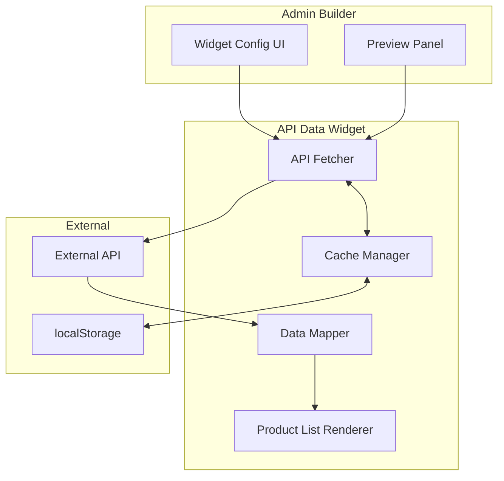

# Design Document: API Data Widget

## Overview

API Data Widget là một widget mới cho hệ thống page builder, cho phép fetch dữ liệu từ API bên ngoài và hiển thị theo template (mặc định là danh sách sản phẩm). Widget tích hợp vào `DynamicWidgetRenderer` hiện có và sử dụng cơ chế serialization của builder.

## Architecture



## Components and Interfaces

### 1. API Action Configuration

```typescript
interface ApiAction {
  endpoint: string;
  method: 'GET' | 'POST';
  headers?: Record<string, string>;
  body?: Record<string, unknown>;
  auth?: AuthConfig;
}

interface AuthConfig {
  type: 'none' | 'bearer' | 'apiKey';
  token?: string;
  apiKeyHeader?: string;
  apiKeyValue?: string;
}
```

### 2. Data Mapper Configuration

```typescript
interface DataMapperConfig {
  rootPath: string;           // JSONPath to array, e.g., "data.products"
  itemMapping: ItemMapping;
}

interface ItemMapping {
  name: string;        // Path to name field, e.g., "title"
  price: string;       // Path to price field, e.g., "price.amount"
  image: string;       // Path to image URL
  description: string; // Path to description
  url?: string;        // Path to detail URL
}
```

### 3. Widget Configuration

```typescript
interface ApiDataWidgetConfig {
  id: string;
  type: 'ApiDataWidget';
  action: ApiAction;
  dataMapper: DataMapperConfig;
  display: DisplayConfig;
  cache: CacheConfig;
  messages: MessageConfig;
}

interface DisplayConfig {
  layout: 'grid' | 'list';
  columns: 2 | 3 | 4;
  showImage: boolean;
  showPrice: boolean;
  showDescription: boolean;
  currency: string;
  placeholderImage: string;
}

interface CacheConfig {
  enabled: boolean;
  duration: number; // seconds
}

interface MessageConfig {
  loading: string;
  error: string;
  empty: string;
}
```

### 4. Component Structure

```
src/components/admin/builder/
├── core/types/
│   └── apiDataWidget.types.ts    # Type definitions
├── services/apiData/
│   ├── index.ts                  # Service exports
│   ├── ApiFetcher.ts             # API fetching logic
│   ├── DataMapper.ts             # Data mapping utilities
│   └── CacheManager.ts           # Cache management
├── ui/widgets/apiData/
│   ├── index.ts                  # UI exports
│   ├── ApiDataWidget.tsx         # Main widget component
│   ├── ApiDataWidgetConfig.tsx   # Builder config UI
│   ├── ProductCard.tsx           # Product card component
│   └── ProductGrid.tsx           # Grid layout component
└── utils/
    └── sanitize.ts               # XSS sanitization utilities
```

## Data Models

### API Response Example

```json
{
  "success": true,
  "data": {
    "products": [
      {
        "id": 1,
        "title": "Product Name",
        "price": { "amount": 99.99, "currency": "USD" },
        "thumbnail": "https://example.com/image.jpg",
        "description": "Product description"
      }
    ]
  }
}
```

### Mapped Data Structure

```typescript
interface MappedProduct {
  name: string;
  price: number | null;
  image: string | null;
  description: string | null;
  url: string | null;
}
```

### Cache Entry

```typescript
interface CacheEntry {
  data: MappedProduct[];
  timestamp: number;
  widgetId: string;
}
```

## Correctness Properties

*A property is a characteristic or behavior that should hold true across all valid executions of a system-essentially, a formal statement about what the system should do. Properties serve as the bridge between human-readable specifications and machine-verifiable correctness guarantees.*

### Property 1: API Request Construction

*For any* valid ApiAction configuration, the constructed fetch request SHALL include all specified headers, authentication, and body parameters exactly as configured.

**Validates: Requirements 1.1, 1.2, 1.3, 1.4, 1.5, 1.6, 1.7**

### Property 2: Data Extraction Correctness

*For any* valid JSON object and dot-notation path, the extracted value SHALL equal the value at that path, or null if the path does not exist.

**Validates: Requirements 2.1, 2.3**

### Property 3: Mapping Completeness

*For any* API response array and valid ItemMapping, the mapped result SHALL have the same length as the source array.

**Validates: Requirements 2.2, 2.4**

### Property 4: Fallback Handling

*For any* API response with missing fields, the mapped product SHALL contain null for missing fields without throwing errors.

**Validates: Requirements 2.5**

### Property 5: Product Rendering Completeness

*For any* MappedProduct array, the rendered output SHALL contain exactly one ProductCard for each item in the array.

**Validates: Requirements 3.2, 3.3**

### Property 6: Placeholder Image Substitution

*For any* MappedProduct with null image, the rendered ProductCard SHALL display the configured placeholder image.

**Validates: Requirements 3.4**

### Property 7: Cache Behavior Correctness

*For any* cache configuration with duration > 0, data fetched within the TTL SHALL be returned from cache; data fetched after TTL expiry SHALL trigger a new API request.

**Validates: Requirements 5.2, 5.4**

### Property 8: Configuration Serialization Round-Trip

*For any* valid ApiDataWidgetConfig, serializing to JSON and deserializing SHALL produce an equivalent configuration object.

**Validates: Requirements 6.6**

### Property 9: URL Validation in Production

*For any* endpoint URL not starting with "https://", validation SHALL fail when in production mode.

**Validates: Requirements 7.1**

### Property 10: XSS Sanitization

*For any* string containing HTML tags or script elements, the sanitized output SHALL escape all potentially dangerous characters.

**Validates: Requirements 7.2**

### Property 11: Token Non-Exposure

*For any* rendered HTML output from ApiDataWidget, the output SHALL NOT contain the raw authentication token value.

**Validates: Requirements 7.3**

## Error Handling

### API Errors

```typescript
type ApiError = 
  | { type: 'network'; message: string }
  | { type: 'timeout'; message: string }
  | { type: 'http'; status: number; message: string }
  | { type: 'parse'; message: string };
```

### Error States

1. **Network Error**: Display error message, log details, allow retry
2. **HTTP Error (4xx/5xx)**: Display error message with status
3. **Parse Error**: Display error message, log raw response
4. **Empty Data**: Display empty state message

### Validation Errors

1. **Missing Endpoint**: Block save, show validation error
2. **Invalid URL Format**: Block save, show format error
3. **HTTP in Production**: Block save, show security warning

## Testing Strategy

### Unit Tests

- DataMapper path extraction with various JSON structures
- Cache TTL calculation and expiration
- URL validation logic
- HTML sanitization function
- Price formatting with different currencies

### Property-Based Tests

Using `fast-check` library for property-based testing:

1. **Data Extraction Property**: Generate random JSON objects and paths, verify extraction correctness
2. **Fallback Handling Property**: Generate objects with random missing fields, verify no errors
3. **Serialization Round-Trip**: Generate random configs, verify serialize/deserialize equivalence
4. **Sanitization Property**: Generate strings with HTML, verify all tags escaped
5. **Cache Behavior Property**: Generate cache entries with various timestamps, verify TTL logic

### Integration Tests

- Full widget render with mock API response
- Builder config UI interaction
- Cache persistence in localStorage
