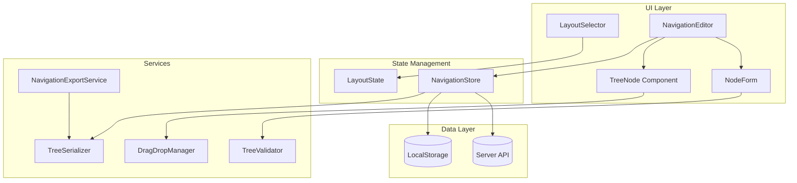

# Design Document: Layout Selector & Navigation Editor

## Overview

Tính năng Layout Selector và Navigation Editor mở rộng Page Builder với khả năng:
1. Chọn và cấu hình layout templates cho trang
2. Quản lý navigation menu dạng tree với drag-and-drop
3. CRUD operations cho navigation nodes
4. Export navigation data ra TypeScript file

Thiết kế tuân theo kiến trúc hiện có của builder module, sử dụng React components với TypeScript và tích hợp với hệ thống persistence hiện tại.

## Architecture



## Components and Interfaces

### Core Types

```typescript
// Navigation Node - represents a single menu item
interface NavigationNode {
  id: string;
  text: string;
  href: string;
  target?: '_blank' | '_self';
  icon?: string;
  children?: NavigationNode[];
}

// Header Data Structure
interface HeaderData {
  links: NavigationNode[];
  actions: Array<{
    text: string;
    href: string;
    target?: string;
  }>;
}

// Footer Link Group
interface FooterLinkGroup {
  title: string;
  links: Array<{
    text: string;
    href: string;
  }>;
}

// Social Link
interface SocialLink {
  ariaLabel: string;
  icon: string;
  href: string;
}

// Footer Data Structure
interface FooterData {
  links: FooterLinkGroup[];
  secondaryLinks: Array<{ text: string; href: string }>;
  socialLinks: SocialLink[];
  footNote: string;
}

// Layout Template
type LayoutType = 
  | 'full-width'
  | 'with-sidebar-left'
  | 'with-sidebar-right'
  | 'minimal-header'
  | 'no-footer';

interface LayoutConfig {
  type: LayoutType;
  headerVisible: boolean;
  footerVisible: boolean;
  sidebarPosition: 'left' | 'right' | 'none';
}

// Page Configuration (extended)
interface PageConfig {
  layout: LayoutConfig;
  headerData: HeaderData;
  footerData: FooterData;
}
```

### UI Components

```typescript
// LayoutSelector Component
interface LayoutSelectorProps {
  currentLayout: LayoutConfig;
  onLayoutChange: (layout: LayoutConfig) => void;
}

// NavigationEditor Component
interface NavigationEditorProps {
  mode: 'header' | 'footer';
  data: HeaderData | FooterData;
  onChange: (data: HeaderData | FooterData) => void;
}

// TreeNode Component
interface TreeNodeProps {
  node: NavigationNode;
  depth: number;
  maxDepth: number;
  onEdit: (node: NavigationNode) => void;
  onDelete: (nodeId: string) => void;
  onAddChild: (parentId: string) => void;
  dragHandleProps: DragHandleProps;
}

// NodeForm Component
interface NodeFormProps {
  node?: NavigationNode;
  mode: 'add' | 'edit';
  onSubmit: (node: NavigationNode) => void;
  onCancel: () => void;
}
```

### Services

```typescript
// DragDropManager
interface DragDropManager {
  startDrag(nodeId: string): void;
  updateDropTarget(targetId: string, position: 'before' | 'after' | 'child'): void;
  completeDrop(): TreeUpdateResult;
  cancelDrag(): void;
  isValidDrop(sourceId: string, targetId: string): boolean;
}

// TreeValidator
interface TreeValidator {
  validateNode(node: Partial<NavigationNode>): ValidationResult;
  validateTree(tree: NavigationNode[]): ValidationResult;
  getMaxDepth(tree: NavigationNode[]): number;
}

// TreeSerializer
interface TreeSerializer {
  serialize(tree: NavigationNode[]): string;
  deserialize(json: string): NavigationNode[];
  toTypeScript(headerData: HeaderData, footerData: FooterData): string;
}

// ValidationResult
interface ValidationResult {
  valid: boolean;
  errors: Array<{
    field: string;
    message: string;
  }>;
}

// TreeUpdateResult
interface TreeUpdateResult {
  success: boolean;
  tree: NavigationNode[];
  movedNodeId: string;
  newParentId: string | null;
  newIndex: number;
}
```

## Data Models

### Navigation Tree Structure

```typescript
// Example Header Data
const headerData: HeaderData = {
  links: [
    {
      id: 'home',
      text: 'Trang chủ',
      href: '/',
    },
    {
      id: 'services',
      text: 'Dịch vụ',
      href: '/services',
      children: [
        { id: 'pricing', text: 'Bảng giá', href: '/pricing' },
        { id: 'projects', text: 'Dự án', href: '/personal#projects' },
      ],
    },
  ],
  actions: [
    { text: 'GitHub', href: 'https://github.com/ptndz', target: '_blank' },
  ],
};
```

### State Management

```typescript
// Navigation Store State
interface NavigationState {
  headerData: HeaderData;
  footerData: FooterData;
  layout: LayoutConfig;
  isDirty: boolean;
  lastSaved: Date | null;
  dragState: {
    isDragging: boolean;
    draggedNodeId: string | null;
    dropTargetId: string | null;
    dropPosition: 'before' | 'after' | 'child' | null;
  };
}

// Actions
type NavigationAction =
  | { type: 'SET_HEADER_DATA'; payload: HeaderData }
  | { type: 'SET_FOOTER_DATA'; payload: FooterData }
  | { type: 'SET_LAYOUT'; payload: LayoutConfig }
  | { type: 'ADD_NODE'; payload: { parentId: string | null; node: NavigationNode; target: 'header' | 'footer' } }
  | { type: 'UPDATE_NODE'; payload: { nodeId: string; updates: Partial<NavigationNode>; target: 'header' | 'footer' } }
  | { type: 'DELETE_NODE'; payload: { nodeId: string; target: 'header' | 'footer' } }
  | { type: 'MOVE_NODE'; payload: TreeUpdateResult & { target: 'header' | 'footer' } }
  | { type: 'START_DRAG'; payload: string }
  | { type: 'UPDATE_DROP_TARGET'; payload: { targetId: string; position: 'before' | 'after' | 'child' } }
  | { type: 'END_DRAG' }
  | { type: 'MARK_SAVED' };
```

## Correctness Properties

*A property is a characteristic or behavior that should hold true across all valid executions of a system-essentially, a formal statement about what the system should do. Properties serve as the bridge between human-readable specifications and machine-verifiable correctness guarantees.*

### Property 1: Layout Selection Persistence
*For any* layout selection operation, the selected layout should be retrievable from the page configuration immediately after selection.
**Validates: Requirements 1.2, 1.4**

### Property 2: Navigation Tree Building
*For any* valid header or footer data, converting it to a tree structure and back should produce equivalent data.
**Validates: Requirements 2.1, 3.1**

### Property 3: Node Addition Invariant
*For any* add node operation with valid data, the resulting tree should contain exactly one more node than before, and that node should have the specified properties.
**Validates: Requirements 2.2, 3.2, 3.3, 5.2**

### Property 4: Node Update Preservation
*For any* edit operation on a node, only the specified properties should change while all other properties and the tree structure remain unchanged.
**Validates: Requirements 2.3, 5.4**

### Property 5: Node Deletion Completeness
*For any* delete operation on a node, the node and all its descendants should be removed from the tree, and no other nodes should be affected.
**Validates: Requirements 2.4, 5.6**

### Property 6: Tree Depth Constraint
*For any* navigation tree, the maximum depth should not exceed 2 levels (root + 1 level of children).
**Validates: Requirements 2.5**

### Property 7: Drag-Drop Tree Integrity
*For any* valid drag-drop operation, the total number of nodes in the tree should remain constant, and the moved node should appear at the new position.
**Validates: Requirements 2.6, 4.3**

### Property 8: Invalid Drop Prevention
*For any* attempt to drop a node into one of its own descendants, the operation should be rejected and the tree should remain unchanged.
**Validates: Requirements 4.5**

### Property 9: Drag Cancel Restoration
*For any* cancelled drag operation, the tree state should be identical to the state before the drag started.
**Validates: Requirements 4.7**

### Property 10: Node Validation
*For any* navigation node, validation should fail if text or href fields are empty or missing.
**Validates: Requirements 2.7, 5.7**

### Property 11: Serialization Round-Trip
*For any* valid navigation tree, serializing to JSON and deserializing should produce an equivalent tree structure.
**Validates: Requirements 7.1, 7.2, 7.3**

### Property 12: TypeScript Export Format
*For any* valid header and footer data, the exported TypeScript should be syntactically valid and match the expected navigation.ts structure.
**Validates: Requirements 6.3, 6.4**

### Property 13: Auto-Save Consistency
*For any* modification to navigation data, the local storage should contain the updated data.
**Validates: Requirements 6.1, 3.7**

## Error Handling

### Validation Errors
- Empty text field: "Link text is required"
- Empty href field: "Link URL is required"
- Invalid URL format: "Please enter a valid URL"
- Max depth exceeded: "Cannot add more than 2 levels of nesting"

### Drag-Drop Errors
- Invalid drop target: Silently reject and show visual feedback
- Self-drop: Prevent dropping node onto itself
- Circular reference: Prevent dropping parent into child

### Persistence Errors
- Local storage full: Show warning, continue with in-memory state
- Server save failed: Show error toast, retain local changes
- Network timeout: Retry with exponential backoff

### Deserialization Errors
- Invalid JSON: Reset to default empty state
- Schema mismatch: Attempt migration, fallback to defaults

## Testing Strategy

### Unit Tests
- TreeValidator: Test validation rules for nodes and trees
- TreeSerializer: Test serialization/deserialization
- DragDropManager: Test drop validity checks

### Property-Based Tests
Using fast-check library for TypeScript:

1. **Serialization Round-Trip** (Property 11)
   - Generate random valid navigation trees
   - Serialize and deserialize
   - Assert equality

2. **Node CRUD Invariants** (Properties 3, 4, 5)
   - Generate random trees and operations
   - Apply operations
   - Verify invariants hold

3. **Drag-Drop Integrity** (Properties 7, 8, 9)
   - Generate random trees and drag operations
   - Execute operations
   - Verify node count and structure

4. **Validation Completeness** (Property 10)
   - Generate nodes with various field combinations
   - Run validation
   - Verify correct error detection

### Integration Tests
- Full CRUD workflow for navigation nodes
- Drag-drop reordering scenarios
- Export and import cycle
- Layout selection and persistence

### Test Configuration
- Minimum 100 iterations per property test
- Tag format: **Feature: layout-navigation-editor, Property {number}: {property_text}**
