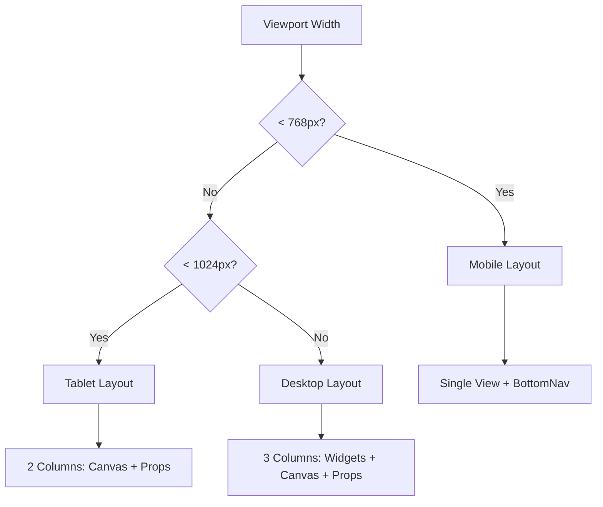

# Design Document: Mobile Responsive Builder

## Overview

This design document outlines the architecture and implementation approach for making the Astro Page Builder and PagesManager components fully responsive and mobile-friendly. The solution leverages existing mobile components from the Story Editor (BottomSheet, BottomNavBar, MobileHeader) while creating builder-specific adaptations.

The design follows a progressive enhancement approach: the desktop experience remains unchanged while mobile/tablet users get an optimized interface that maintains full functionality.

## Architecture

### Component Hierarchy

```
┌─────────────────────────────────────────────────────────────────┐
│                        BuilderApp                                │
│  ┌───────────────────────────────────────────────────────────┐  │
│  │                    useResponsive()                         │  │
│  │         (isMobile, isTablet, isDesktop)                   │  │
│  └───────────────────────────────────────────────────────────┘  │
│                              │                                   │
│              ┌───────────────┼───────────────┐                  │
│              ▼               ▼               ▼                  │
│  ┌─────────────────┐ ┌─────────────┐ ┌─────────────────────┐   │
│  │  Desktop Layout │ │Tablet Layout│ │   Mobile Layout     │   │
│  │  (3 columns)    │ │(2 columns)  │ │   (single view)     │   │
│  └─────────────────┘ └─────────────┘ └─────────────────────┘   │
│                                              │                   │
│                              ┌───────────────┼───────────────┐  │
│                              ▼               ▼               ▼  │
│                      ┌────────────┐ ┌────────────┐ ┌──────────┐│
│                      │BottomSheet │ │BottomNavBar│ │MobileHdr ││
│                      │(Widgets/   │ │(Navigation)│ │(Compact) ││
│                      │ Props)     │ │            │ │          ││
│                      └────────────┘ └────────────┘ └──────────┘│
└─────────────────────────────────────────────────────────────────┘
```

### Layout Strategy



## Components and Interfaces

### 1. MobileBuilderLayout Component

New component that wraps the builder for mobile viewports.

```typescript
interface MobileBuilderLayoutProps {
  blocks: BuilderBlock[];
  selectedId: string | null;
  metadata: PageMetadata;
  onBlocksChange: (blocks: BuilderBlock[]) => void;
  onSelectBlock: (id: string | null) => void;
  onMetadataChange: (metadata: PageMetadata) => void;
  onSave: () => void;
  onBack: () => void;
  isDarkMode: boolean;
}

type MobileView = 'canvas' | 'widgets' | 'properties';
```

### 2. MobileWidgetPicker Component

Widget selection panel optimized for mobile using BottomSheet.

```typescript
interface MobileWidgetPickerProps {
  isOpen: boolean;
  onClose: () => void;
  onSelectWidget: (type: WidgetType) => void;
  searchQuery: string;
  onSearchChange: (query: string) => void;
}
```

### 3. MobilePropertiesPanel Component

Properties editor adapted for mobile using BottomSheet.

```typescript
interface MobilePropertiesPanelProps {
  isOpen: boolean;
  onClose: () => void;
  selectedBlock: BuilderBlock | null;
  selectedDef: WidgetDefinition | null;
  onUpdateProps: (id: string, props: Record<string, unknown>) => void;
  metadata: PageMetadata;
  onMetadataChange: (metadata: PageMetadata) => void;
}
```

### 4. MobileBlockList Component

Touch-optimized block list with drag-and-drop support.

```typescript
interface MobileBlockListProps {
  blocks: BuilderBlock[];
  selectedId: string | null;
  onSelect: (id: string) => void;
  onReorder: (blocks: BuilderBlock[]) => void;
  onDelete: (id: string) => void;
  onDuplicate: (id: string) => void;
}
```

### 5. MobilePagesManager Component

Responsive pages list for mobile devices.

```typescript
interface MobilePagesManagerProps {
  pages: PageInfo[];
  isLoading: boolean;
  searchQuery: string;
  onSearchChange: (query: string) => void;
  onEditPage: (page: PageInfo) => void;
  onDeletePage: (page: PageInfo) => void;
  onPreviewPage: (page: PageInfo) => void;
  onCreateNew: () => void;
  isDarkMode: boolean;
}
```

## Data Models

### Responsive State (Existing)

```typescript
interface ResponsiveState {
  isMobile: boolean;    // < 768px
  isTablet: boolean;    // 768px - 1024px
  isDesktop: boolean;   // > 1024px
  viewportWidth: number;
  viewportHeight: number;
  deviceType: 'mobile' | 'tablet' | 'desktop';
}
```

### Mobile Navigation State

```typescript
interface MobileNavState {
  activeView: MobileView;
  isWidgetSheetOpen: boolean;
  isPropsSheetOpen: boolean;
  isMenuOpen: boolean;
  isPreviewModalOpen: boolean;
}
```

### Touch Interaction State

```typescript
interface TouchState {
  isDragging: boolean;
  draggedBlockId: string | null;
  longPressTarget: string | null;
  contextMenuPosition: { x: number; y: number } | null;
}
```

## Correctness Properties

*A property is a characteristic or behavior that should hold true across all valid executions of a system-essentially, a formal statement about what the system should do. Properties serve as the bridge between human-readable specifications and machine-verifiable correctness guarantees.*

### Property 1: Layout Mode Selection

*For any* viewport width value, the responsive system SHALL select exactly one layout mode where:
- width < 768px → mobile layout
- 768px ≤ width < 1024px → tablet layout  
- width ≥ 1024px → desktop layout

And the selected layout SHALL be mutually exclusive (no two layouts active simultaneously).

**Validates: Requirements 1.1, 1.2, 1.3**

### Property 2: Touch Target Compliance

*For any* interactive element (buttons, links, form inputs, draggable items) rendered in mobile or tablet layout, the computed touch target area SHALL be at least 44x44 pixels.

**Validates: Requirements 3.1, 8.2**

### Property 3: Panel State Preservation

*For any* panel (widgets, properties, preview) that is opened, modified, then closed and reopened, the panel state (selected items, form values, scroll position) SHALL be equivalent to the state before closing.

**Validates: Requirements 2.2, 7.3, 8.1**

### Property 4: Block Operations Equivalence

*For any* block operation (add, delete, duplicate, reorder) and any initial blocks array, performing the operation on mobile layout SHALL produce an identical resulting blocks array as performing the same operation on desktop layout.

**Validates: Requirements 1.4, 3.2, 3.3**

### Property 5: Navigation Tab Synchronization

*For any* tab selection in the mobile bottom navigation bar, the active tab indicator position SHALL match the selected tab, and the visible panel content SHALL correspond to the selected tab's associated view.

**Validates: Requirements 2.1, 2.2**

### Property 6: Search Filter Consistency

*For any* search query string applied to the widget list or pages list, the filtered results on mobile layout SHALL contain exactly the same items as the filtered results on desktop layout.

**Validates: Requirements 4.3, 7.4**

### Property 7: Save Operation Equivalence

*For any* blocks array and metadata, the MDX content generated when saving from mobile layout SHALL be byte-identical to the MDX content generated when saving the same data from desktop layout.

**Validates: Requirements 9.1, 9.2**

### Property 8: BottomSheet Dismissal

*For any* open BottomSheet, either swiping down past the threshold OR tapping outside the sheet area SHALL result in the sheet closing and returning to the previous view state.

**Validates: Requirements 8.4**

### Property 9: Widget Selection Behavior

*For any* widget type selected from the mobile widget picker, the widget SHALL be added to the blocks array AND the widget picker sheet SHALL close automatically.

**Validates: Requirements 7.3**

### Property 10: Preference Persistence Round-Trip

*For any* user preference (preview mode, dark mode), setting the preference, closing the browser, and reopening SHALL restore the same preference value.

**Validates: Requirements 6.4**

## Error Handling

### Touch Interaction Errors

| Error Scenario | Handling Strategy |
|----------------|-------------------|
| Drag cancelled mid-operation | Restore block to original position, clear drag state |
| Long press on non-block element | Ignore, no context menu shown |
| Swipe gesture not recognized | Fall back to tap behavior |
| Touch outside interactive area | Close any open sheets/menus |

### Layout Transition Errors

| Error Scenario | Handling Strategy |
|----------------|-------------------|
| Resize during drag operation | Cancel drag, restore state |
| Panel open during layout change | Close panel, preserve content |
| Selected block deleted | Clear selection, close props panel |

### Network/Save Errors

| Error Scenario | Handling Strategy |
|----------------|-------------------|
| Save fails on mobile | Show mobile-friendly error toast, preserve local state |
| Image upload fails | Show retry option in mobile dialog |
| GitHub auth expired | Redirect to auth with return URL |

## Testing Strategy

### Unit Tests

Unit tests will verify specific component behaviors and edge cases:

1. **Responsive hook tests**: Verify breakpoint detection accuracy
2. **Touch handler tests**: Verify gesture recognition (long press, swipe, drag)
3. **Layout component tests**: Verify correct layout renders for each viewport
4. **Panel state tests**: Verify state preservation across open/close cycles

### Property-Based Tests

Property-based tests will use fast-check to verify universal properties:

1. **Layout consistency property**: Generate random viewport widths, verify single layout mode
2. **Touch target property**: Generate random interactive elements, verify minimum size
3. **Block operations property**: Generate random operation sequences, verify equivalence
4. **Search filter property**: Generate random queries, verify result consistency

### Integration Tests

1. **Mobile navigation flow**: Navigate between all tabs, verify content updates
2. **Block editing flow**: Add block, edit props, save - verify persistence
3. **Pages management flow**: Create, edit, delete pages on mobile

### Test Configuration

- Property tests: Minimum 100 iterations per property
- Use `@testing-library/react` for component tests
- Use `fast-check` for property-based testing
- Mock `window.innerWidth` for responsive tests
- Use `@testing-library/user-event` for touch simulation
